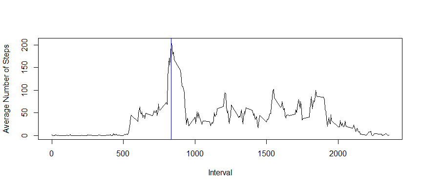

# Reproducible Research: Peer Assessment 1
## Part 1:Loading and Preprocessing the Data

```r
        fileUrl<-"http://d396qusza40orc.cloudfront.net/repdata%2Fdata%2Factivity.zip"
        download.file(url=fileUrl,destfile="Activity.zip")
        unzip("Activity.zip")
        activity<-read.csv("activity.csv")
        class(activity)
```

```
## [1] "data.frame"
```

```r
        str(activity)
```

```
## 'data.frame':	17568 obs. of  3 variables:
##  $ steps   : int  NA NA NA NA NA NA NA NA NA NA ...
##  $ date    : Factor w/ 61 levels "2012-10-01","2012-10-02",..: 1 1 1 1 1 1 1 1 1 1 ...
##  $ interval: int  0 5 10 15 20 25 30 35 40 45 ...
```

```r
        head(activity)
```

```
##   steps       date interval
## 1    NA 2012-10-01        0
## 2    NA 2012-10-01        5
## 3    NA 2012-10-01       10
## 4    NA 2012-10-01       15
## 5    NA 2012-10-01       20
## 6    NA 2012-10-01       25
```

```r
        tail(activity)
```

```
##       steps       date interval
## 17563    NA 2012-11-30     2330
## 17564    NA 2012-11-30     2335
## 17565    NA 2012-11-30     2340
## 17566    NA 2012-11-30     2345
## 17567    NA 2012-11-30     2350
## 17568    NA 2012-11-30     2355
```

```r
        summary(activity)
```

```
##      steps                date          interval     
##  Min.   :  0.00   2012-10-01:  288   Min.   :   0.0  
##  1st Qu.:  0.00   2012-10-02:  288   1st Qu.: 588.8  
##  Median :  0.00   2012-10-03:  288   Median :1177.5  
##  Mean   : 37.38   2012-10-04:  288   Mean   :1177.5  
##  3rd Qu.: 12.00   2012-10-05:  288   3rd Qu.:1766.2  
##  Max.   :806.00   2012-10-06:  288   Max.   :2355.0  
##  NA's   :2304     (Other)   :15840
```

### Examining Missing Values

```r
                sum(is.na(activity$steps))
```

```
## [1] 2304
```


### Missing Values by Date

```r
                missing_values<-tapply(is.na(activity$steps),activity$date,sum)
                missing_values[missing_values>0]
```

```
## 2012-10-01 2012-10-08 2012-11-01 2012-11-04 2012-11-09 2012-11-10 
##        288        288        288        288        288        288 
## 2012-11-14 2012-11-30 
##        288        288
```
        
### Distribution of steps 

```r
                quantile(activity$steps,na.rm=TRUE,probs=c(0.5,0.6,0.7,0.8,0.9,0.95,1))
```

```
##    50%    60%    70%    80%    90%    95%   100% 
##   0.00   0.00   0.00  28.00  86.00 252.85 806.00
```


## Part 2:Mean and Median Total Sumber of Steps Taken Per Day
### Histogram of Total Number of Steps Taken Per Day

```r
                total_steps<-tapply(activity$steps,activity$date,sum,na.rm=TRUE)
                summary(total_steps)
```

```
##    Min. 1st Qu.  Median    Mean 3rd Qu.    Max. 
##       0    6778   10400    9354   12810   21190
```

```r
                hist(total_steps,xlab="Total steps per day",
                     main="Histogram of total daily steps")
```

 

### Computing Mean and Median Total Steps Taken Per Day

```r
                mean_total_steps<-mean(total_steps)
                mean_total_steps
```

```
## [1] 9354.23
```

```r
                median_total_steps<-median(total_steps)
                median_total_steps
```

```
## [1] 10395
```


## Part 3:Average Daily Activity Pattern
### Number of steps for each 5 minute interval averaged across all days

```r
                interval_steps<-tapply(activity$steps,as.factor(activity$interval)
                                       ,mean,na.rm=TRUE)
```
### Median number of steps for each 5 minute interval across all days

```r
                interval_steps_median<-tapply(activity$steps,as.factor(activity$interval),
                              median,na.rm=TRUE)
```


### 5-minute interval containing maximum number of steps

```r
                uniq_intervals<-unique(activity$interval)
                max(interval_steps)
```

```
## [1] 206.1698
```

```r
                max_interval<-uniq_intervals[interval_steps==max(interval_steps)]
                max_interval
```

```
## [1] 835
```

###Time Series Plot of 5-minute interval versus Average steps 

```r
                plot(uniq_intervals,interval_steps,type="l",xlab="Interval",
                     ylab="Average Number of Steps")
                abline(v=max_interval,col="blue2")
```

 
       
#### Conclusion: The 835 interval contains the maximum activity. The average maximum activity 
#### for this time interval is 206.1698 steps
        


## Part 4:Imputing Missing Values
### Total number of Missing Values

```r
                missing_vals<-sum(is.na(activity))
                missing_vals
```

```
## [1] 2304
```

```r
                isnas<-which(is.na(activity$steps))
```
### Strategy 1:Creating a new dataset by Replacing missing values with Mean of 5-minute interval

```r
                activity$impsteps<-replace(activity$steps,isnas,interval_steps)
```
### Strategy 2:Creating a new dataset by Replacing missing values with Median of 5-minute interval

```r
                activity$impsteps_median<-replace(activity$steps,isnas,interval_steps_median)
```
### Strategy 1: Analysis with mean imputed values

```r
                total_impsteps<-tapply(activity$impsteps,activity$date,sum)
                mean_total_impsteps<-mean(total_impsteps)
                mean_total_impsteps
```

```
## [1] 10766.19
```

```r
                median_total_impsteps<-median(total_impsteps)
                median_total_impsteps
```

```
## [1] 10766.19
```
####Histogram of total number of steps for Strategy 1

```r
                hist(total_impsteps,xlab="Total steps per day",
                        main="Histogram of total daily steps after imputing mean values")
```

 


### Strategy 1: Comparison of means and medians before and after imputing mean missing values
####Mean Total Steps (without imputing missing values)= 9354.23
####Mean Total Steps (after imputing average values) =  10766.19
####Median Total Steps (without imputing missing values)= 10395
####Median Total Steps (after imputing average values) = 10766.19
                

### Strategy 2: Analysis with median imputed values

```r
                total_impsteps_median<-tapply(activity$impsteps_median,activity$date,sum)
                mean_total_impsteps_median<-mean(total_impsteps_median)
                mean_total_impsteps_median
```

```
## [1] 9503.869
```

```r
                median_total_impsteps_median<-median(total_impsteps_median)
                median_total_impsteps_median
```

```
## [1] 10395
```
####Histogram of total number of steps for Strategy 2

```r
                        hist(total_impsteps_median,xlab="Total steps per day",
                        main="Histogram of total daily steps after imputing median values")
```

 

### Strategy 2: Comparison of means and medians before and after imputing median missing values
####Mean Total Steps without imputing missing values= 9354.23
####Mean Total Steps after imputing median values) =  9503.869 
####Median Total Steps without imputing missing values)= 10395
####Median Total Steps after imputing median values) = 10395    
### Impact of imputing Missing Values in Strategy 1 and Strategy 2

### Comparison between Strategy 1 and Strategy 2
#### Strategy 1 : Mean value increases, Median also increases
#### Strategy 2 : Mean value decreases, Median value remains the same
#### Since after imputing median values the histogram of the total number of steps more closely
####resembles the original histogram and estimates are less biased, Strategy 2 is preferred. 
                     


## Part 5: Differences in Activity patterns between weekdays and weekends
#### Since Strategy 2 appears to create less biases in the computation of mean and median values 
####I shall use the dataset created by following Strategy 2 (median imputation)
####for this part of the analysis    

### Determining day of week

```r
                activity$asdate<-as.Date(activity$date,"%Y-%m-%d")
                class(activity$asdate)
```

```
## [1] "Date"
```

```r
                activity$day<-weekdays(activity$asdate)
```
### Creating a  Binary factor variable for weekday or weekend

```r
                activity$wkend<-activity$day %in% c("Saturday","Sunday")
```
### Computing the Interval averages for weekdays and weekends

```r
                wkdayavg<-tapply(activity$impsteps_median[activity$wkend=="FALSE"],as.factor
                 (activity$interval[activity$wkend=="FALSE"]),mean)
                wkendavg<-tapply(activity$impsteps_median[activity$wkend=="TRUE"],
                 as.factor(activity$interval[activity$wkend=="TRUE"]),mean)
```
### Plotting Weekday versus Weekend activity

```r
                par(mfrow=c(2,1),mar=c(4,4,2,1))
                plot(uniq_intervals,wkdayavg,type="l",col="blue",
                main=list("Weekdays",cex=1),xlab="",ylab="Number of steps")        
                plot(uniq_intervals,wkendavg,type="l",col="violet",
                main=list("Weekends",cex=1),xlab=list("Interval",cex=1.25),
                ylab="Number of steps")
```

 

### Conclusions: 
####There seem to be considerable differences between weekdays and weekends
#### 1. The maximum number of steps during weekdays is higher than in the weekends
#### 2. The number of steps during weekdays spikes sharply in the morning hours around  8 to 9 am 
#### 2. The average number of steps is distributed more uniformly across the various 
#### 5-minute intervals in the weekend than in the weekdays.
